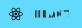

###  Hi there, I'm Andrew, aka. 🍋 Lemon

My name is Andrew Black and I am a web developer, designer and also a producer from Szeged, Hungary. I do a lot of things, and some of them you may even find interesting.

---

### 🤔 What do I do?

  
  
  
  
  
  
  

- I’m currently (and constantly) working on my personal projects, which are tools and websites.
- I'm working on several React projects with my favourite website Netlify.
- I also make logo design and every kind of designs, so if you need a good logo just hmu
- In my hobby im making music and instrumentals.

---

### ✉️ Send me a message!

- I am open for collaborations (musicly as well), so if you find my work interesting feel free to send me a message!   Here is where you can find me:

  
  
  

    <i>Let's connect, you can contact me via ...</i>
      
    
    &nbsp;
    
    &nbsp;
    
    &nbsp;
    

  

